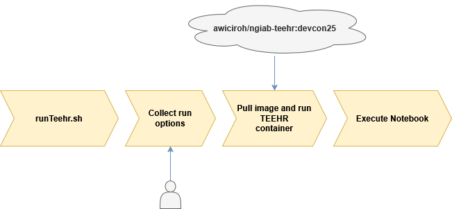
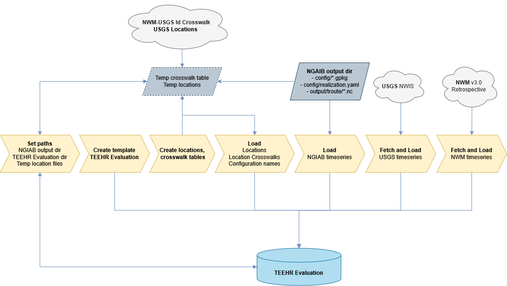

# Coupling TEEHR with NGIAB in a Containerized Environment
## `runTeehr.sh` Options:
- `Last used data directory path`:
  - Path to NGIAB output directory.
- `Select TEEHR run options`:
  - Build TEEHR Evaluation
  - Calculate performance metrics
  - Launch JupyterLab
- `Specify the TEEHR image tag to use`:
  - Docker image tag
- `Select an option (type a number)`:
  - Use local or remote docker image

  

## Notebook Execution Details
- `notebooks/01_TEEHR_NGIAB.ipynb`
- `ngiab_utils.py`: Utilities for extracting data from NGIAB output.
- `teehr_utils.py`: Utilities for creating the TEEHR Evaluation dataset.

---

### 1. Creating the TEEHR Evaluation
- `teehr_utils.create_teehr_evaluation()`
- `ngiab_utils.py`

  

---

### 2. Calculating Performance Metrics
- `teehr_utils.calculate_metrics()`

  

---

### 3. Open Interactive Session
- Opens `01_TEEHR_NGIAB.ipynb` in JupyterLab
