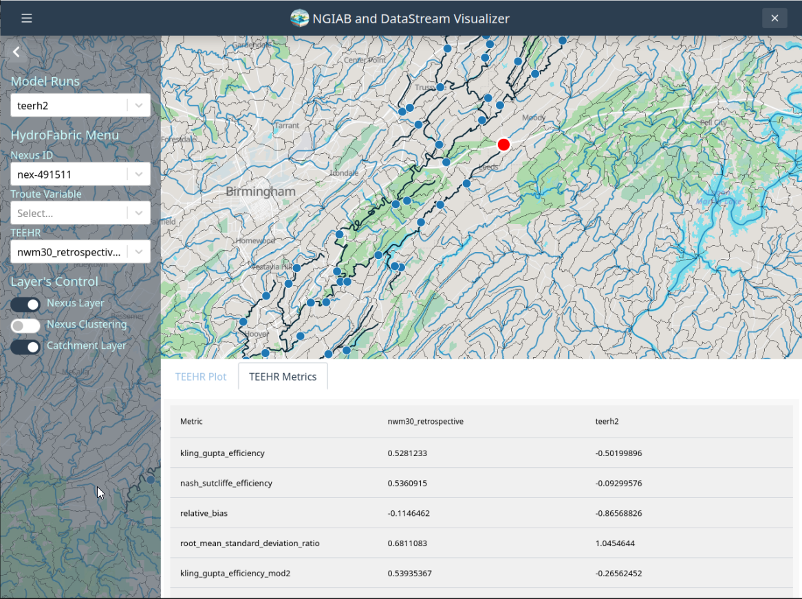

# Output visualization through Tethys

The Visualizaer is an application developed using the Tethys Platform! we strive to lower the barrier for scientist to create wedn apps.

## Cloning the visualizer repo:
```bash
cd ~/
git clone https://github.com/CIROH-UA/ngiab-client.git

```
## Run the ./viewOnTethys.sh script

```bash
cd ~/ngiab-client/
./viewOnTethys.sh
```

For the portion `PREPARING VISUALIZATION ENVIRONMENT` use the following inputs if you are prompt:

```bash
ℹ Last used data directory: /home/exouser/workshop/teehr/cat-491334-partial
  ⚠ /home/exouser/ngiab_visualizer is not empty.
  → Keep (K) or Fresh start (F)? [K/F]: k
ℹ Reclaiming ownership of /home/exouser/ngiab_visualizer  (sudo may prompt)…
  ⚠ Directory exists: /home/exouser/ngiab_visualizer/cat-491334-partial
  → Overwrite (O) or Duplicate (D)? [O/D]: o
  ✓ Overwritten ➜ /home/exouser/ngiab_visualizer/cat-491334-partial
Checking for /home/exouser/ngiab_visualizer/ngiab_visualizer.json...
  ✓ Model run “cat-491334-partial” registered (df3e74ed-e317-4f13-97d1-82154ba1a737)
ℹ Reclaiming ownership of /home/exouser/.datastream_ngiab  (sudo may prompt)…
  ℹ No existing Datastream cache found – a fresh download will be used.
```
On summary, it would be `/home/exouser/workshop/teehr/cat-491334-partial` -> `k` -> `o` -> `f`

if you do not geet prompt anything here, you are fine. Do not worry

For the portion `LAUNCHING TETHYS VISUALIZATION` use the following inputs:

```bash
Specify the Tethys image tag to use:
  → Tag (e.g. v0.2.1, default: latest): teehr-devcon25
  ℹ Found local image awiciroh/tethys-ngiab:teehr-devcon25
  → Use local copy (L) or Pull latest from registry (P)? [L/P]: p
  ✓ Using local image
Select a port to run Tethys on. [Default: 80]
  → Port: 8080
  ✓ Port 8080 selected

```

On summary, it would be `teehr-devcon25` -> `p` -> `8080`

Now, we wait, and once the container is ready and we are prompted to login, we go to RealVNC or TigerVNC to `http://localhost:8080/apps/ngiab`


## Get More data with different metrics

We will just copy the same dataset to run teerh again, so we can have multiple models to visualize

```bash
 cp -R /home/exouser/workshop/teehr/cat-491334-partial/ /home/exouser/workshop/teehr/teehr2
```

Now, we just need to add more metrics to the teerh pyuthon script called: `teehr_ngiab.py`.

when inside RealVNC or TigerVNC open the file at `/home/exouser/workshop/teehr/teehr-devcon25-workshop/notebooks/utils/teehr_ngiab.py`

and add the following:

```python 
...
        df = ev.metrics.query(
        order_by=["primary_location_id", "configuration_name"],
        group_by=["primary_location_id", "configuration_name"],
        include_metrics=[
            teehr.DeterministicMetrics.KlingGuptaEfficiency(),
            teehr.DeterministicMetrics.NashSutcliffeEfficiency(),
            teehr.DeterministicMetrics.RelativeBias(),
            teehr.DeterministicMetrics.RootMeanStandardDeviationRatio(),
            teehr.DeterministicMetrics.KlingGuptaEfficiencyMod2(), # <--New Metric
            teehr.DeterministicMetrics.PearsonCorrelation(), # <--New Metric
            teehr.DeterministicMetrics.NashSutcliffeEfficiency() # <--New Metric
        ]
    ).to_pandas()
```

Save it!

## Run TEEHR again!

Now let's run the `runTeehr.sh` again

```bash
cd /home/exouser/workshop/teehr/teehr-devcon25-workshop
./runTeehr.sh
```

Select only options 1,2 and 4. we will not be opening notebooks this time.

## Use The visualizer again.

Once is done, let's go the visualizer!

```bash
cd ~/ngiab-client/
./viewOnTethys.sh
```

For the portion `PREPARING VISUALIZATION ENVIRONMENT` use the following inputs if you are prompt:

```bash
ℹ Last used data directory: /home/exouser/workshop/teehr/teehr2
  ⚠ /home/exouser/ngiab_visualizer is not empty.
  → Keep (K) or Fresh start (F)? [K/F]: k
ℹ Reclaiming ownership of /home/exouser/ngiab_visualizer  (sudo may prompt)…
  ⚠ Directory exists: /home/exouser/ngiab_visualizer/teehr2
  → Overwrite (O) or Duplicate (D)? [O/D]: o
  ✓ Overwritten ➜ /home/exouser/ngiab_visualizer/teehr2
Checking for /home/exouser/ngiab_visualizer/ngiab_visualizer.json...
  ✓ Model run “teehr2” registered (df3e74ed-e317-4f13-97d1-82154ba1a737)
ℹ Reclaiming ownership of /home/exouser/.datastream_ngiab  (sudo may prompt)…
  ℹ No existing Datastream cache found – a fresh download will be used.
```
On summary, it would be 
`/home/exouser/workshop/teehr/teehr2 `-> `k` -> `o` -> `f`

if you do not geet prompt anything here, you are fine. Do not worry

For the portion `LAUNCHING TETHYS VISUALIZATION` use the following inputs:

```bash
Specify the Tethys image tag to use:
  → Tag (e.g. v0.2.1, default: latest): teehr-devcon25
  ℹ Found local image awiciroh/tethys-ngiab:teehr-devcon25
  → Use local copy (L) or Pull latest from registry (P)? [L/P]: p
  ✓ Using local image
Select a port to run Tethys on. [Default: 80]
  → Port: 8080
  ✓ Port 8080 selected

```
You will be able to see both of your `teehr` outputs now.

Now you should see something like this:

<p align="center">
  
</p>

